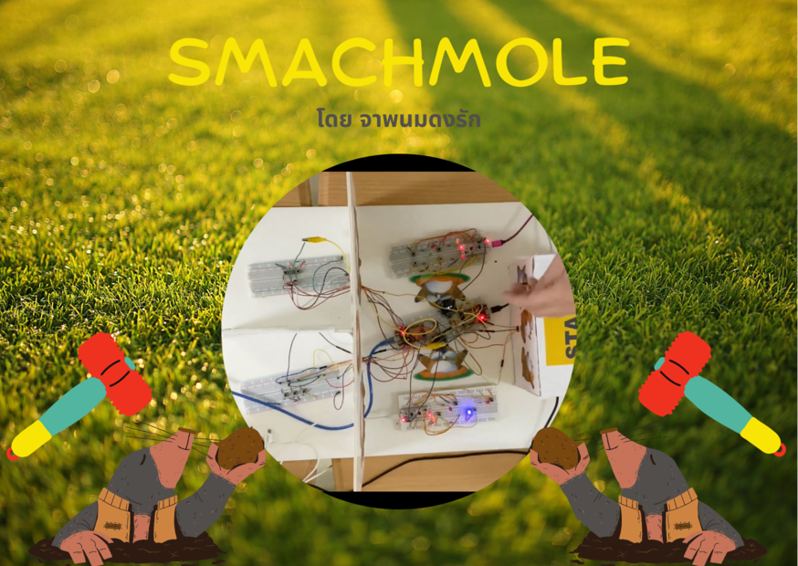
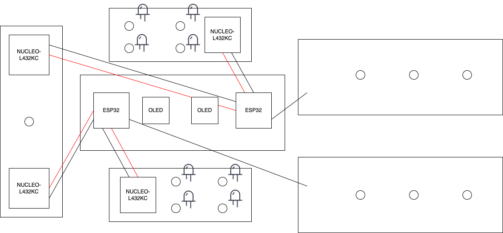
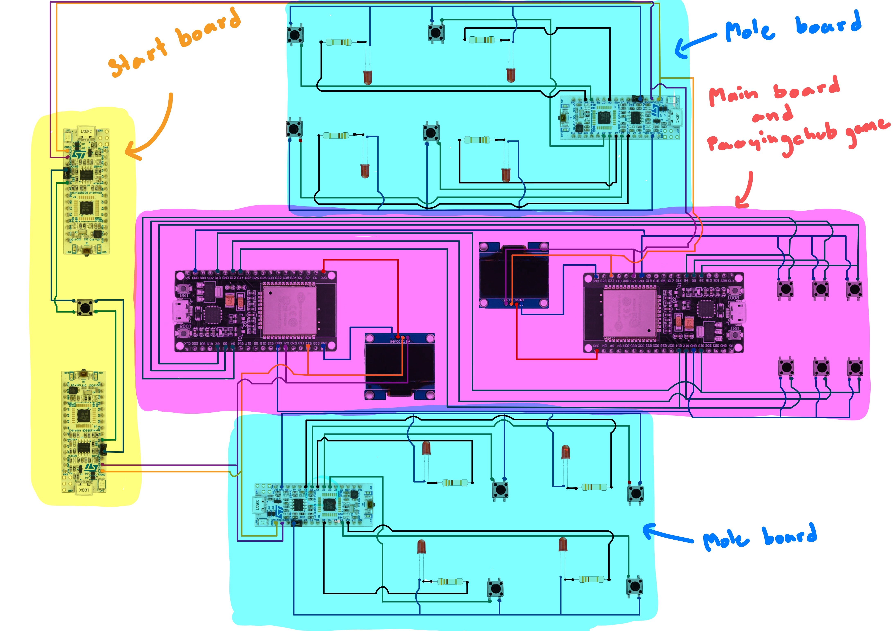
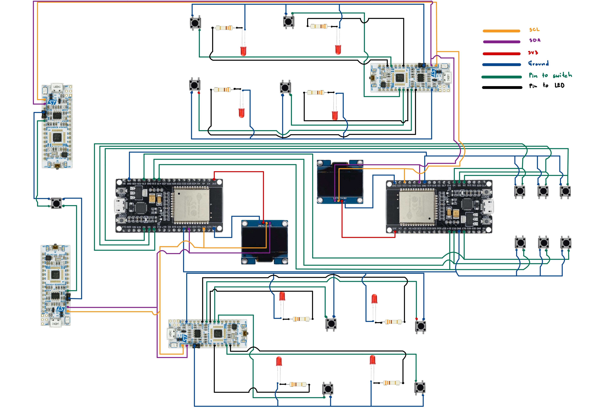

## Introduction
**smachmole project** เกิดจากการที่พวกเรากลุ่ม "จาพนมดงรัก" ชื่นชอบการเล่นเกมตีตัวตุ่นที่อยู่ในห้างสรรพสินค้าสมัยก่อน ซึ่งเป็นที่นิยมมากในหมู่เด็กๆในยุคนั้น แต่ ณ ปัจจุบัน โซนตู้เกมส์ในห้างสรรพสินค้านั้นได้ถูกยกเลิกไปเกือบหมดแล้วทำให้เกมส์ตีตัวตุ่นที่พวกเราชื่นชอบได้หายไป จึงเป็นแรงบันดาลใจให้เกิด **smachmole project** ขึ้น

โดยพวกเราได้นำอุปกรณ์ที่มีในชั้นเรียนมาประยุกต์และปรับใช้เพื่อสร้างเป็นเกมส์ตีตัวตุ่นในฉบับของพวกเรา!!!

## Features	
- เกมตีตุ่นเล่นได้โดยกดปุ่มตามที่ไฟขึ้น
- โชว์คะแนนที่หน้าจอได้
- โชว์ว่าเริ่มเกมและจบเกมที่หน้าจอได้
- เกมเป่ายิ้งชุบเล่นได้โดยเราสามารถเลือกได้ว่าเราจะกดปุ่มค้อน,กระดาษ,กรรไกร
- สามารถกดปุ่มสตาร์ทเพื่อเล่นเกมและจะมีเวลานับถอยหลังเพื่อให้คนที่จะเล่นได้เตรียมตัวให้พร้อม

## How to play
เริ่มเล่นโดยกดปุ่ม start แล้วให้ผู้เล่น 1 คน จากแต่ละฝั่งเริ่มกดปุ่มตามที่ไฟขึ้น โดยจะมีผู้เล่นอีก 1 คนจากแต่ละฝั่งเล่นเกมเป่ายิ้งฉุบ โดยเลือกกดปุ่ม1ใน3ปุ่มเพื่อเลือกว่าจะออกอะไรแล้วผู้ชนะจะไปลดแต้มของอีกฝั่ง เกมจะจบภายใน30วิหลังกด start

## Designs and Technical
โดยเราได้ดีไซน์ให้มี main board (ESP32) ในการรันโปรแกรมหลักๆโดยที่จะมี start board และ mole board เป็นบอร์ดเสริมในการส่งข้อมูลเพื่อให้ main board สามารถรันโปรแกรมได้

### Main Board (ESP32)
- เป็นบอร์ดหลักที่รันเกมส์ตีตัวตุ่นและเกมส์เป่ายิ้งฉุบ
- เป็นบอร์ดที่รับการสื่อสารจาก start board และ mole board
- แสดงผลคะแนนบนจอ OLED
- มีเกมส์เป่ายิ้งฉุบรันควบคู่กับเกมส์ตีตัวตุ่น (แยก thraed)

### Start Board (NUCLEO-L432KC)
- มีการสื่อสารกับ main board
- เมื่อมีการกดสวิตซ์ (start game!) จะส่งสัญญาณให้กับ main board ว่าให้เริ่มเกมส์ได้

### Mole Board (NUCLEO-L432KC)
- มีการสื่อสารกับ main board
- เมื่อมีการกดปุ่มตามที่ไฟขึ้น จะส่งสัญญาณให้กับ main board เพื่อให้ main board เพิ่มคะแนนให้กับผู้เล่น

### Communications
- main board, start board และ mole board สื่อสารกันด้วย i2c protocol โดยใช้ขาพิน SCL และ SDA 

## Components
1. ESP32 board 2 เครื่อง
2. NUCLEO-L432KC 4 เครื่อง
3. micro switch 15 ชิ้น
4. led 8 ชิ้น
5. OLED 2 ชิ้น
6. resistor 330+-5% ohm 4 ชิ้น
7. resistor 10k+-1% ohm 4 ชิ้น
8. USB cable (Type-A to micro) 6 เส้น
9. wires

## Tools
- Thonny (micropython)
- Embedded Studio Cloud
- Librarys in Micropython
	- time
	- ssd1306
	- threading
	- utime
	- machine(I2C, Pin)
- Librarys in Mbed
	- mbed.h
	- DebounceIn.h